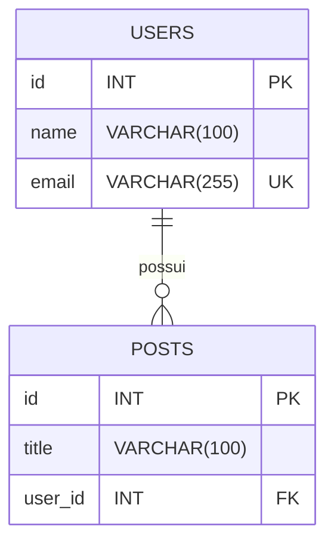

# 🎓 **Aula 6 – Realizando consultas com ORM**

## 🎯 **Objetivos da Aula**

* Entender o que é um **ORM** e como o TypeORM facilita o trabalho com banco de dados.
* Comparar o uso de SQL manual (`mysql2/promise`) com ORM.
* Criar entidades e mapear para tabelas com **decorators**.
* Implementar **relacionamentos** (One-to-Many, Many-to-One) no TypeORM.
* Usar `relations` para simular **JOINs** automaticamente.

---

## 🧩 O que é um ORM?

ORM significa **Object-Relational Mapping** (*Mapeamento Objeto-Relacional*).
Basicamente, é uma ferramenta que permite interagir com o banco de dados **usando objetos e métodos** ao invés de escrever SQL puro.

💡 **Por que usar ORM?**

* 📉 Menos repetição de código SQL
* 🛡️ Menos risco de SQL Injection (ele faz o tratamento automático)
* 🗂️ Melhor organização do código
* 🔄 Portabilidade entre diferentes bancos de dados

## 🧠 **Retomando o que já aprendemos**

Até agora:

* Usamos `mysql2/promise` para **escrever queries SQL diretamente**.
* Controlávamos tudo: desde o `SELECT` até as condições, paginação e `JOINs`.

Exemplo no **mysql2/promise**:

```ts
const [rows] = await connection.query(
  'SELECT * FROM usuarios WHERE id = ?',
  [id]
);
```

---

Agora, no **TypeORM**:

```ts
const user = await userRepository.findOneBy({ id });
```

💡 A diferença:

* No mysql2 → você escreve o SQL manualmente.
* No TypeORM → você descreve *o que quer*, e ele gera o SQL.

---

## 🏗️ **Configurando o TypeORM**

O TypeORM é um ORM para JavaScript e TypeScript que facilita a interação com bancos de dados relacionais de forma orientada a objetos, através do uso de decoradores.

## **🤔 Como iniciar um projeto com TypeORM?**

Instalar dependências:

```bash
npm init -y
npm install express typeorm reflect-metadata mysql2 dotenv
npm install -D typescript @types/express @types/node
```

Configurar transpilador do TypeScript:

```bash
npx tsc --init
```

Altere o coneúdo do arquivo `tsconfig.json`

```json
{
  "compilerOptions": {
    "target": "ES2020",
    "module": "commonjs",
    "outDir": "./dist",
    "rootDir": "./src",
    "strict": true,
    "esModuleInterop": true,
    "experimentalDecorators": true,
    "emitDecoratorMetadata": true
  },
  "include": ["src/**/*.ts"],
  "exclude": ["node_modules"]
}
```

> [!NOTE]
> <details>
> <summary>Explicação dos comandos adicionais</summary>
>    
> Esses dois comandos são essenciais quando trabalhamos com bibliotecas que usam **decorators** (como TypeORM, NestJS, class-validator etc.).
> 
> - **`experimentalDecorators`** → Habilita o uso da sintaxe de *decorators* no TypeScript (`@Algo`). Como decorators ainda não fazem parte oficial e final da especificação do JavaScript (estão em estágio avançado, mas não finalizado), o TypeScript trata como um recurso "experimental" e precisa dessa flag para permitir o uso.
> 
>   Exemplo:
>   ```ts
>   @Entity()
>   class User { ... }
>   ```
> 
> - **`emitDecoratorMetadata`** → Faz o TypeScript **emitir metadados adicionais** no JavaScript compilado sempre que encontrar um decorator. Esses metadados permitem que bibliotecas consigam ler informações de tipos em tempo de execução usando `Reflect.metadata`.
> 
>   Exemplo: o TypeORM consegue saber automaticamente que `name: string` é uma *string* por conta desses metadados.
> 
> 💡 **Em Resumo:**  
> Sem `experimentalDecorators`, você nem consegue usar `@decorator`.  
> Sem `emitDecoratorMetadata`, muitos frameworks que dependem de informações de tipos nos decorators simplesmente não funcionam corretamente.
> </details>

---

Arquivo `src/config/data-source.ts`:

```ts
import 'reflect-metadata';
import { DataSource } from 'typeorm';
import * as dotenv from "dotenv";

dotenv.config();

const { DB_HOST, DB_PORT, DB_USER, DB_PASSWORD, DB_NAME } = process.env;

export const AppDataSource = new DataSource({
    type: 'mysql',
    host: DB_HOST,
    port: Number(DB_PORT || "3306"),
    username: DB_USER,
    password: DB_PASSWORD,
    database: DB_NAME,
    synchronize: true, // CUIDADO! Apenas em desenvolvimento (em ambiente de produção será false)
    logging: true,
    entities: ['src/models/*.ts'],
});
```

---

## 📦 **Criando Entidades**

O TypeORM usa **classes** para representar tabelas.

### `src/models/User.ts`

```ts
import { Entity, PrimaryGeneratedColumn, Column, OneToMany } from 'typeorm';
import { Post } from './Post';

@Entity('users') // Informa para o ORM que essa classe será uma Entidade do Banco de Dados
export class User {
    @PrimaryGeneratedColumn() // Define que o campo será uma Chave Primária (PK) e Auto Incrementável (AI)
    id: number;

    @Column({ length: 100, nullable: false }) // Define que o tamanho do campo é de 100 caracteres, e não pode ser nulo.
    name: string;

    @Column({ unique: true }) // Define que o campo é Único (UK)
    email: string;

    /*
        - Indica para o ORM que existe uma relação de 1 para Muitos (1:N) com a Entidade Posts.
        - Essa Relação será indicada da outra entidade também, e o ORM irá criar a Chave Estrangeira (FK) automaticamente.
        - Essa prática é extremamente importante para que possam ser realizadas consultas em múltiplas tabelas posteriormente.
    */
    @OneToMany(() => Post, post => post.user)
    posts: Post[];
}
```

### `src/models/Post.ts`

```ts
import { Entity, PrimaryGeneratedColumn, Column, ManyToOne } from 'typeorm';
import { User } from './User';

@Entity('posts')
export class Post {
    @PrimaryGeneratedColumn()
    id: number;

    /*
        - Define o campo como sendo um VARCHAR.
        - Essa definição é opcional pois o ORM identifica pelo tipo da propriedade no TypeScript.
    */
    @Column({ type: "varchar", length: 100, nullable: false })
    title: string;


    /*
        - Indica para o ORM que existe uma relação de Muitos para 1 (N:1) com a Entidade Users.
        - Essa Relação foi indicada da outra entidade também, e o ORM irá criar a Chave Estrangeira (FK) automaticamente.
        - Sempre que ouver relacões entre entidades precisamos declarar a "ida e a volta".
        - Ou seja, se a relação entre Users e Posts for de 1:N a relação entre Posts e Users será de N:1.
        - Essa referência cruzada é obrigatória para que o ORM crie corretamente as Chaves Estrangeiras (FK)
    */
    @ManyToOne(() => User, user => user.posts)
    user: User;
}
```

### Diagrama de Entidade e Relacionamento (DER)



---

## 🔗 **Relacionamentos e JOINs**

No MySQL puro, um **INNER JOIN** ficaria assim:

```sql
SELECT u.*, p.*
FROM users u
INNER JOIN posts p ON p.user_id = u.id;
```

No TypeORM, a mesma coisa:

```ts
const users = await userRepository.find({
    relations: ['posts']
});
```

* `relations` → diz quais tabelas devem ser carregadas junto.
* TypeORM **gera o JOIN automaticamente**.

---

## 🚦 **Criando Controllers**

### `src/controllers/UserController.ts`

```ts
import { Request, Response } from 'express';
import { AppDataSource } from '../config/data-source';
import { User } from '../models/User';

const userRepository = AppDataSource.getRepository(User);

export class UserController {
    // Listar todos os usuários com posts (GET /users)
    async list(req: Request, res: Response) {
        try {
            const users = await userRepository.find({ 
                relations: ['posts'],
                order: { id: 'ASC' } 
            });
            return res.json(users);
        } catch (error) {
            return res.status(500).json({ message: 'Internal server error' });
        }
    }

    // Obter um usuário específico (GET /users/:id)
    async show(req: Request, res: Response) {
        try {
            const { id } = req.params;
            const user = await userRepository.findOne({ 
                where: { id: Number(id) },
                relations: ['posts']
            });

            if (!user) {
                return res.status(404).json({ message: 'User not found' });
            }

            return res.json(user);
        } catch (error) {
            return res.status(500).json({ message: 'Internal server error' });
        }
    }

    // Criar novo usuário (POST /users)
    async create(req: Request, res: Response) {
        try {
            const { name, email } = req.body;
            
            // Validação simples
            if (!name || !email) {
                return res.status(400).json({ message: 'Name and email are required' });
            }

            const userExists = await userRepository.findOneBy({ email });
            if (userExists) {
                return res.status(409).json({ message: 'Email already in use' });
            }

            const user = userRepository.create({ name, email });
            await userRepository.save(user);
            
            return res.status(201).json(user);
        } catch (error) {
            return res.status(500).json({ message: 'Internal server error' });
        }
    }

    // Atualizar usuário (PATCH /users/:id)
    async update(req: Request, res: Response) {
        try {
            const { id } = req.params;
            const { name, email } = req.body;

            const user = await userRepository.findOneBy({ id: Number(id) });
            if (!user) {
                return res.status(404).json({ message: 'User not found' });
            }

            // Atualiza apenas os campos fornecidos
            if (name) user.name = name;
            if (email) {
                const emailExists = await userRepository.findOneBy({ email });
                if (emailExists && emailExists.id !== user.id) {
                    return res.status(409).json({ message: 'Email already in use by another user' });
                }
                user.email = email;
            }

            await userRepository.save(user);
            return res.json(user);
        } catch (error) {
            return res.status(500).json({ message: 'Internal server error' });
        }
    }

    // Deletar usuário (DELETE /users/:id)
    async delete(req: Request, res: Response) {
        try {
            const { id } = req.params;
            const user = await userRepository.findOneBy({ id: Number(id) });
            
            if (!user) {
                return res.status(404).json({ message: 'User not found' });
            }

            await userRepository.remove(user);
            return res.status(204).send(); // No Content
        } catch (error) {
            return res.status(500).json({ message: 'Internal server error' });
        }
    }
}
```

### `src/controllers/PostController.ts`

```ts
import { Request, Response } from 'express';
import { AppDataSource } from '../config/data-source';
import { Post } from '../models/Post';
import { User } from '../models/User';

const postRepository = AppDataSource.getRepository(Post);
const userRepository = AppDataSource.getRepository(User);

export class PostController {
    // Listar todos os posts (GET /posts)
    async list(req: Request, res: Response) {
        try {
            const posts = await postRepository.find({ 
                relations: ['user'],
                order: { id: 'ASC' }
            });
            return res.json(posts);
        } catch (error) {
            return res.status(500).json({ message: 'Internal server error' });
        }
    }

    // Obter um post específico (GET /posts/:id)
    async show(req: Request, res: Response) {
        try {
            const { id } = req.params;
            const post = await postRepository.findOne({ 
                where: { id: Number(id) },
                relations: ['user']
            });

            if (!post) {
                return res.status(404).json({ message: 'Post not found' });
            }

            return res.json(post);
        } catch (error) {
            return res.status(500).json({ message: 'Internal server error' });
        }
    }

    // Criar novo post (POST /posts)
    async create(req: Request, res: Response) {
        try {
            const { title, userId } = req.body;
            
            if (!title || !userId) {
                return res.status(400).json({ message: 'Title and userId are required' });
            }

            const user = await userRepository.findOneBy({ id: Number(userId) });
            if (!user) {
                return res.status(404).json({ message: 'User not found' });
            }

            const post = postRepository.create({ title, user });
            await postRepository.save(post);
            
            return res.status(201).json(post);
        } catch (error) {
            return res.status(500).json({ message: 'Internal server error' });
        }
    }

    // Atualizar post (PATCH /posts/:id)
    async update(req: Request, res: Response) {
        try {
            const { id } = req.params;
            const { title, userId } = req.body;

            const post = await postRepository.findOneBy({ id: Number(id) });
            if (!post) {
                return res.status(404).json({ message: 'Post not found' });
            }

            // Atualiza o título se fornecido
            if (title) post.title = title;

            // Atualiza o usuário se userId for fornecido
            if (userId) {
                const user = await userRepository.findOneBy({ id: Number(userId) });
                if (!user) {
                    return res.status(404).json({ message: 'User not found' });
                }
                post.user = user;
            }

            await postRepository.save(post);
            return res.json(post);
        } catch (error) {
            return res.status(500).json({ message: 'Internal server error' });
        }
    }

    // Deletar post (DELETE /posts/:id)
    async delete(req: Request, res: Response) {
        try {
            const { id } = req.params;
            const post = await postRepository.findOneBy({ id: Number(id) });
            
            if (!post) {
                return res.status(404).json({ message: 'Post not found' });
            }

            await postRepository.remove(post);
            return res.status(204).send(); // No Content
        } catch (error) {
            return res.status(500).json({ message: 'Internal server error' });
        }
    }
}
```

---

## 🌐 **Rotas**

`src/routes/userRoutes.ts`

```ts
import { Router } from 'express';
import { UserController } from '../controllers/UserController';

const routes = Router();
const userController = new UserController();

// Rotas de Usuários
routes.get('/users', userController.list);          // Listar todos
routes.get('/users/:id', userController.show);      // Mostrar um
routes.post('/users', userController.create);       // Criar
routes.patch('/users/:id', userController.update);  // Atualizar
routes.delete('/users/:id', userController.delete); // Deletar

export default routes;
```

`src/routes/postRoutes.ts`

```ts
import { Router } from 'express';
import { PostController } from '../controllers/PostController';

const routes = Router();
const postController = new PostController();

// Rotas de Posts
routes.get('/posts', postController.list);          // Listar todos
routes.get('/posts/:id', postController.show);      // Mostrar um
routes.post('/posts', postController.create);       // Criar
routes.patch('/posts/:id', postController.update);  // Atualizar
routes.delete('/posts/:id', postController.delete); // Deletar

export default routes;
```

## 🚀 **Arquivo Principal `src/server.ts`**

```ts
import express, { Application } from "express";
import { AppDataSource } from "./config/data-source";
import userRoutes from "./routes/userRoutes";
import postRoutes from "./routes/postRoutes";

const app: Application = express();
const PORT: number = Number(process.env.PORT || "3000");

app.use(express.json());

// Utilizando as rotas na aplicação
app.use("/api", userRoutes);
app.use("/api", postRoutes);

// Inicializando conexão com o banco de dados
AppDataSource.initialize().then(() => {
    console.log("Database connected successfully!");
    app.listen(PORT, () => {
        console.log(`Server running on http://localhost:${PORT}`);
    });
}).catch((error) => {
    console.error("Error connecting to database.", error);
});
```

---

## 📝 **Exercícios Práticos**

1. Criar as entidades `Category` e `Product`.
2. Relacione `Category` com `Product` (One-to-Many).
3. Criar rota `/products` que já traga junto a categoria (usando `relations`).

---

## ✅ **Resumo da Aula**

* ORM = camada que converte **objetos/classe** em **tabelas**.
* TypeORM usa **decorators** para mapear tabelas.
* `relations` carrega dados de outras tabelas (JOIN).
* Relacionamentos no TypeORM:

  * `@OneToMany`
  * `@ManyToOne`

* Dá pra fazer tudo que fizemos com SQL puro, mas com menos código repetitivo.
